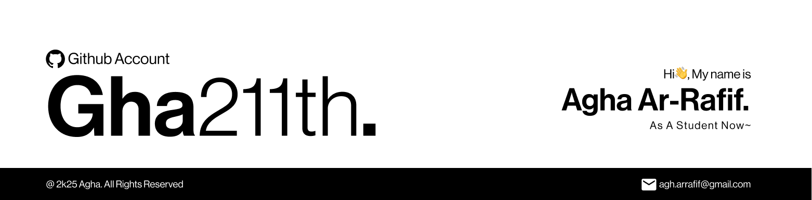

# Hello There 👋, I'm Agha
self-taught *maybe code hobbyist:p

  

I've been programming since i was a kid(13), here are some of what i made :)

## My Own Mini Project🛠️
- [(🖥️211 Shell)](https://github.com/Gha211th/211-Shell), a simple mini shell that created with using python, OSlib, Shlexlib, etc.
- [(🔨PyGen)](https://github.com/Gha211th/PyGen), Python code-generator(basic), build an example of code.

---

  
  

